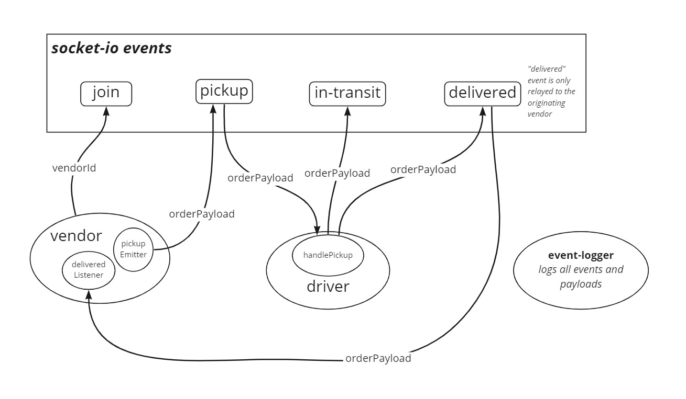

# Code Academy Parcel Service (CAPS)

A real-time service that allows for vendors, such as flower shops or restaurants, to alert a system of a package needing to be delivered, for drivers to instantly see what’s in their pickup queue, and then to alert the vendors as to the state of the deliveries (in transit, and then delivered).

This application has no outward features or routes. It currently has no function when deployed.

[**Deployed API**](https://jjtech-caps.herokuapp.com/)

## UML

## Installation

1. Clone from this repo `git clone https://github.com/jeffreyjtech/caps.git`
2. `cd` into `caps`
3. Run `npm install`
4. Optionally, create an .env file with variable `PORT` to assign your preferred port number. The default `PORT` is `3000`.

## Usage

After installation, run `npm start`.

## Contributors / Authors

- Jeffrey Jenkins

## Features / Routes

As stated in the overview, this application has no outward features or routes, and it has no function when deployed.

## Old UML Diagrams

### Lab 11

