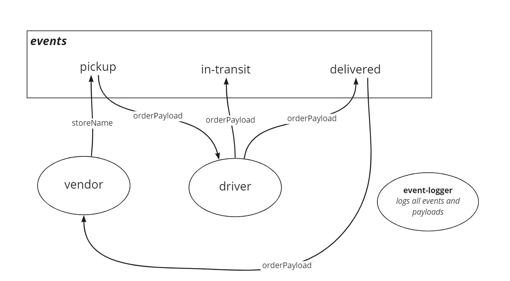

# Code Academy Parcel Service (CAPS)

A real-time service that allows for vendors, such as flower shops or restaurants, to alert a system of a package needing to be delivered, for drivers to instantly see what’s in their pickup queue, and then to alert the vendors as to the state of the deliveries (in transit, and then delivered).

As of Lab 13, this repo can almost be used to create a client-server application. It now uses a queue for storing events when the recipient is disconnected.

[**Deployed API**](https://jjtech-caps.herokuapp.com/)

## UML

## Installation

1. Clone from this repo `git clone https://github.com/jeffreyjtech/caps.git`
2. `cd` into `caps`
3. Run `npm install`
4. Optionally, create an .env file with variable `PORT` to assign your preferred port number. The default `PORT` is `3000`.

## Usage

After installation, run `npm start`.

## Contributors / Authors

- Jeffrey Jenkins

## Features / Routes

As stated in the overview this repo can almost be used to create a client-server application, but not quite. More work is required to ensure that both client and server could be deployed and can be configured to use real endpoints with real URLs.

## Old UML Diagrams

### Lab 11

### Lab 12

